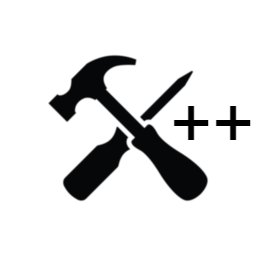

<h1 align="center">

MultiTool++

</h1>

## A Improved Version Of Multitools by hkarargi
### Original Features
Original features include round, cash, and health change
### New Features
- Changeable Hotkeys
  - Now allows you to change the hotkeys
- Monkey Cash, xp, and knowledge change
  - Allows you to set your Cash, xp, and knowledge
- Add Event Trophies
  - Allows you to add more Trophies to your current amount

